     

# ⚡ Awesome Webhook Integration Management

## 🌐 Top Webhook Integration Management Ecosystem

**A Curated Ecosystem of Commercial SaaS Platforms & Open-Source Webhook Infrastructure**  
*Focused on Webhook Delivery, Ingestion, Payload Transformation, HMAC Verification & Self-Hosted Webhook Gateways*  

📅 **Last updated: October 2026**

---

### 📖 Overview & SEO Guide

**Webhook Integration Management** is a critical software domain focused on real-time event-driven architecture (EDA). This curated repository tracks enterprise-grade **SaaS platforms**, **cloud-native gateways**, and **open-source developer tools** designed for sending, receiving, buffering, transforming, and observing HTTP webhooks between cloud services and applications.

Whether you are building outbound webhook dispatchers (like Svix or Convoy) or ingesting multi-provider incoming events (via Hookdeck, n8n, or adnanh/webhook), this guide evaluates solutions based on **pricing, free tier limits, market valuation, security features (HMAC verification, replay protection), and GitHub popularity**.

---

## 📌 Table of Contents
- [📊 SaaS / Hosted Commercial Platforms](#-saas--hosted-commercial-platforms)
- [🔓 Open-Source GitHub Projects](#-open-source-github-projects)
- [⚙️ Architectural Patterns & Comparison](#%EF%B8%8F-architectural-patterns--comparison)
- [🤝 How to Contribute](#-how-to-contribute)
- [⚠️ Disclaimer](#%EF%B8%8F-disclaimer)
- [❤️ Support & Sponsor](#%EF%B8%8F-support--sponsor)
- [⭐ Star History](#-star-history)

---

## 📊 SaaS / Hosted Commercial Platforms

> 📈 **Sector Market Analysis**: The global **Webhook & Integration Gateway Market** is currently estimated at **$1.8 Billion – $2.5 Billion** (as a specialized segment of the broader $12B+ Integration Platform as a Service / iPaaS industry). The sector is **highly fragmented**, spanning enterprise no-code automation platforms (Zapier, Make), developer infrastructure APIs (Svix, Hookdeck), and specialized cloud utilities (ngrok, Webhook Relay).

The table below lists leading commercial webhook management and event delivery services, **sorted by estimated Company Size / Valuation (descending)**:

| SaaS Platform | Company Size (Valuation / Revenue) 🔽 | Starting Pricing 💰 | Free Tier / Free Trial Limits 🆓 | Primary Use Case & Key Features 🚀 |
| :--- | :--- | :--- | :--- | :--- |
| **[Zapier Webhooks](https://zapier.com/)** | **~$5.0 Billion** ($200M+ ARR) | `$19.99/month` *(Starter plan)* | **Free Forever**: 100 tasks/mo, 5 active Zaps | Multi-app automation & no-code webhook triggers across 6,000+ cloud services. |
| **[ngrok](https://ngrok.com/)** | **~$200 Million** ($50M+ ARR) | `$8.00/month` *(Personal plan)* | **Free Forever**: 1 agent, 1 GB egress/mo, 1 active endpoint | Secure HTTP tunneling, webhook payload inspection, and localhost exposure for development. |
| **[Make](https://www.make.com/)** | **~$100 Million** *(Acquired by Celonis)* | `$9.00/month` *(Core plan)* | **Free Forever**: 1,000 operations/mo, 100 MB data transfer | Visual workflow automation with webhooks, complex JSON parsing, and multi-step routing. |
| **[Pipedream](https://pipedream.com/)** | **~$15 Million** ($5M+ ARR) | `$19.00/month` *(Basic plan)* | **Free Forever**: 100 credits/day (~3,000 credits/mo) | Developer-centric serverless workflow platform for receiving, transforming, and routing webhooks. |
| **[Svix](https://www.svix.com/)** | **~$10 Million** *(YC Backed)* | `$50.00/month` *(Starter plan)* | **Free Forever**: 50,000 messages/mo, embeddable portal | Enterprise Webhook-as-a-Service for SaaS apps sending outbound webhooks with exponential retries. |
| **[Hookdeck](https://hookdeck.com/)** | **~$8 Million** ($2.5M Seed) | `$49.00/month` *(Team plan)* | **Free Forever**: 10,000 events/mo, 3-day log retention | Managed inbound webhook ingestion proxy, payload transformation, fan-out routing, & CLI forwarding. |
| **[Convoy Cloud](https://getconvoy.io/)** | **~$5 Million** ($1.5M Seed) | `$20.00/month` *(Growth plan)* | **Free Forever**: 10,000 events/mo, multi-region | Cloud-managed high-performance webhooks gateway supporting inbound & outbound event dispatching. |
| **[Webhooks.io](https://webhooks.io/)** | **~$2 Million** (~$1M ARR) | `$49.00/month` *(Starter plan)* | **14-Day Free Trial**: Up to 5,000 webhook events | Outbound webhook delivery monitoring, endpoint health tracking, and automated failure retries. |
| **[Cloudhooks](https://cloudhooks.dev/)** | **~$1 Million** (~$300K ARR) | `$15.00/month` *(Store plan)* | **14-Day Free Trial**: Up to 1,000 events/mo | Serverless webhook processing, payload persistence, and event queueing built for Shopify merchants. |
| **[Webhook Relay](https://webhookrelay.com/)** | **~$500,000** (~$200K ARR) | `$4.50/month` *(Basic plan)* | **Free Forever**: 150 requests/day (~4,500/mo), 1 bucket | Webhook tunneling, internal endpoint forwarding, cross-cloud relaying, & encrypted streams. |
| **[Smee.io](https://smee.io/)** | **Free Public Utility** *(GitHub-Hosted)* | `$0.00/month` *(Public Service)* | **Free Forever**: Unlimited payloads (Public channel buffer) | Open-source webhook payload delivery utility forwarding webhook payloads to local environments. |

---

## 🔓 Open-Source GitHub Projects

Webhook integration management is a thriving open-source domain. Below are top self-hosted webhook gateways, automation engines, and delivery tools, **sorted by GitHub Star Count (descending)**:

1. **[n8n](https://github.com/n8n-io/n8n)** —  **(206,700+ ⭐ Stars)**  
   *Fair-code workflow automation engine featuring native webhook triggers, custom HTTP responses, complex JSON transformations, and self-hosted privacy.*

2. **[adnanh/webhook](https://github.com/adnanh/webhook)** —  **(12,100+ ⭐ Stars)**  
   *Lightweight, highly configurable Go server that listens for incoming HTTP webhooks and executes OS shell commands or scripts securely.*

3. **[Tyk API Gateway](https://github.com/TykTechnologies/tyk)** —  **(10,800+ ⭐ Stars)**  
   *Enterprise open-source API Gateway written in Go with full support for webhook transformation, authentication, and event-driven API middleware.*

4. **[Svix Core Engine](https://github.com/svix/svix-webhooks)** —  **(3,440+ ⭐ Stars)**  
   *Rust-based open-source core for outbound webhooks delivery. Supports Standard Webhooks HMAC signatures, retries, and customer management dashboards.*

5. **[Convoy](https://github.com/frain-dev/convoy)** —  **(2,870+ ⭐ Stars)**  
   *Cloud-native webhooks gateway in Go for inbound & outbound events. Features rate limiting, circuit breaking, fan-out routing, and embeddable UI portals.*

6. **[Hook0](https://github.com/hook0/hook0)** —  **(1,490+ ⭐ Stars)**  
   *Open-source webhook server built with Rust and PostgreSQL. Offers fine-grained REST API subscriptions, event persistence, and a modern dashboard.*

7. **[Hookdeck CLI](https://github.com/hookdeck/hookdeck-cli)** —  **(365+ ⭐ Stars)**  
   *Official developer CLI tool for inspecting, testing, listening, and forwarding real-time HTTP webhook events directly to localhost.*

8. **[Convoy CLI](https://github.com/frain-dev/convoy-cli)** —  **(30+ ⭐ Stars)**  
   *Command-line interface utility for local Convoy event stream debugging and routing webhooks to development servers.*

9. **[HookRelay](https://github.com/Abhishek-Gali/HookRelay)** —  **(10+ ⭐ Stars)**  
   *Security-hardened webhook ingestion gateway featuring HMAC-SHA256 verification, fencing leases, SQL durable queues, and signed replay guards.*

10. **[HookStack](https://github.com/tomcollis/HookStack)** —  **(7+ ⭐ Stars)**  
    *Lightweight open-source webhook store and buffer designed to hold webhooks reliably until background worker systems process them.*

11. **[ronixa/webhook](https://github.com/ronixa/webhook)** —  **(4+ ⭐ Stars)**  
    *Secure multi-tenant webhook distribution system with in-memory, Redis, or Kafka backends and configurable exponential backoff.*

12. **[hookgate](https://github.com/mrrobertkent/hookgate)** —  **(0+ ⭐ Stars)**  
    *Per-source Go webhook verification proxy with fail-closed security and byte-exact forwarding to OpenTelemetry Collector & ClickHouse.*

---

## ⚙️ Architectural Patterns & Comparison

When designing a production webhook stack, architecture decisions fall into two main categories:

- **Inbound Webhook Ingestion (Receiving)**: Focuses on endpoint resilience, HMAC signature verification, protection against payload spikes, and fan-out routing to internal microservices. *Key options: Hookdeck, Convoy, n8n, HookRelay, hookgate.*
- **Outbound Webhook Delivery (Sending)**: Focuses on reliable HTTP dispatching to third-party endpoints, exponential retry algorithms, dead-letter queueing (DLQ), payload signing (Standard Webhooks), and customer portal UI embed. *Key options: Svix, Convoy, Hook0.*

---

## 🤝 How to Contribute

We welcome contributions from integration engineers, platform developers, and open-source creators!

1. 🍴 **Fork** this repository.
2. 📝 **Add or update** entries in `README.md` maintaining the existing structure (ensure accurate pricing, star counts, and links).
3. 🧪 Verify all markdown links and badge formatting.
4. 🚀 Submit a **Pull Request** with a brief summary of the changes.

---

## ⚠️ Disclaimer

- This directory is **community-curated** for information purposes and does not imply official endorsement.
- Webhook payloads often transmit sensitive user data and PII. Always enforce TLS 1.3, secret rotation, and signature verification in production.
- **At-Least-Once Delivery**: Webhooks inherently guarantee at-least-once delivery; downstream receivers must implement idempotency handlers (e.g. tracking `Idempotency-Key` or event IDs).

---

## ❤️ Support & Sponsor

Thank you for visiting and supporting the **Awesome Webhook Integration Management** directory!

If you find this project valuable for your integration stack, platform research, or team projects:
- ⭐ **Star** this repository on GitHub to help others discover it.
- 🍴 **Fork** it to keep a personal reference or contribute new entries.
- 📢 **Share** it with your engineering colleagues and developer communities.
- ☕ **Sponsor / Buy me a coffee**: Support ongoing maintenance and curated developer resources via the [GitHub Sponsors Dashboard](https://github.com/sponsors/ishandutta2007).

---

## ⭐ Star History

---

  <b>Made with ❤️ for integration engineers, platform teams, and developer infrastructure architects.</b> 
  <i>Let's make real-time webhook infrastructure more open, reliable, and secure.</i>

